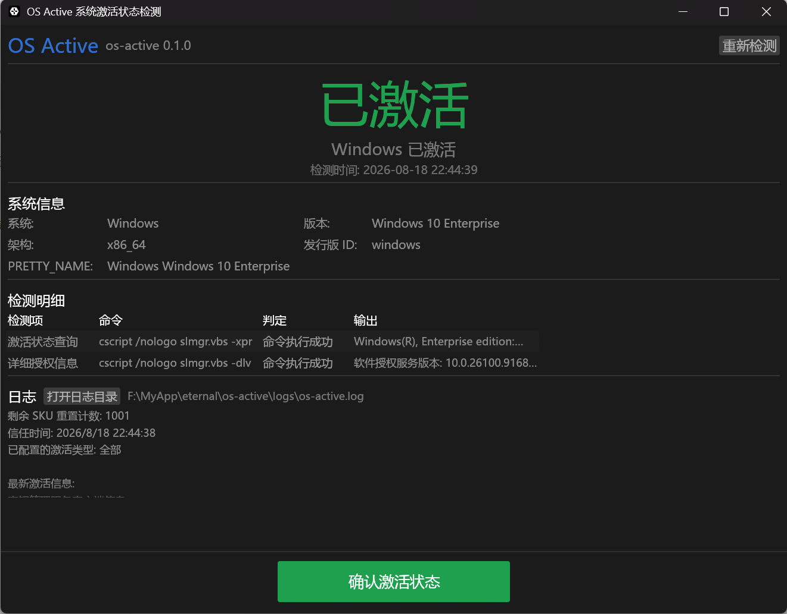
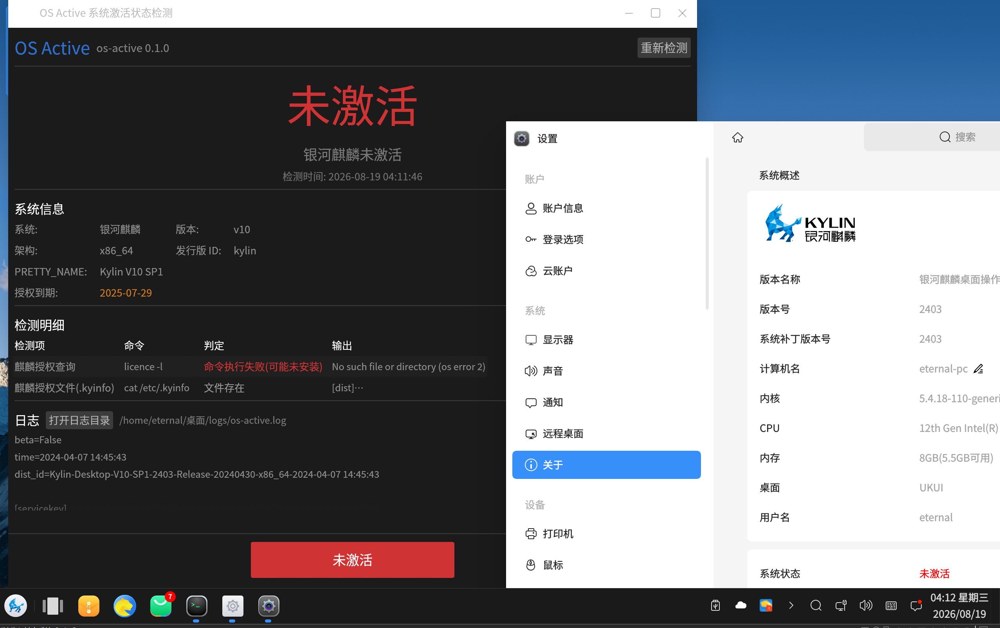
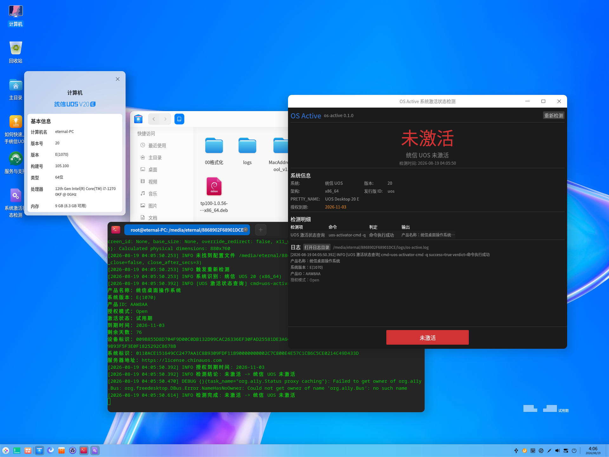

# OS Active 系统激活状态检测

<p>
  
  
  
</p>

<p>
  <a href="https://gitee.com/eternalnight996/os-active">🌟 Gitee</a> |
  <a href="https://github.com/EternalNight996/os-active">🐙 GitHub</a> |
  <a href="https://gitee.com/eternalnight996/os-active/releases">📦 下载</a>
</p>

**一句话**: 跨平台 GUI 工具,一键检测 **银河麒麟 V10 SP1 / 统信 UOS V20 / Ubuntu 18.04+ / Windows 10/11** 的系统激活状态,GUI 大字显示已激活/未激活,e-log 把每条检测命令与原始输出写入 `logs/os-active.log`。

## 功能

- ✅ **激活状态检测**: 启动即自动检测,大字英雄区显示 已激活 / 未激活 / 无需激活 / 无法判定
- ✅ **GUI 明细**: 系统信息(系统/版本/架构/发行版) + 检测明细表格(检测项/命令/判定/原始输出)
- ✅ **e-log 日志**: 所有检测过程、执行命令、原始输出、判定结论写入 `logs/os-active.log`(panic 另写 `logs/bug.os-active.log`)
- ✅ **重新检测**: 一键重跑,后台线程执行不卡界面
- ✅ **跨平台打包**: 复刻 etest 打包链路,Windows zip + Linux deb 一键产出
- ✅ **人工确认**: 检测到已激活后,点击「确认激活状态」按钮确认,结果写入日志
- ✅ **ETest R 标准输出**: 退出时输出 `R<{json}>R`;仅当「激活校验通过 + 已确认(按钮或 auto_close)」才 `status:true`
- ✅ **配置表**: `os-active.toml` 控制倒计时秒数与自动确认

## 界面预览

| Windows 10 | 银河麒麟 V10 | 统信 UOS V20 |
|---|---|---|
|  |  |  |

> 主界面:大字状态英雄区(已激活/未激活) + 底部彩色确认按钮(颜色随状态:绿=已激活/红=未激活/蓝=无需激活/灰=检测中) + 系统信息(含授权到期时间) + 检测明细表格 + 日志区;确认后倒计时自动关闭,退出输出 ETest `R<...>R` 结果。
> 麒麟/统信截图在真机验证:未激活状态(授权过期/试用期)时大字红色 + 底部红色按钮 + 授权到期时间如实显示。

## 激活检测原理

| 系统 | 检测方式 | 判定依据 |
|---|---|---|
| Windows 10/11 | `cscript /nologo slmgr.vbs -xpr` + `-dlv` | 永久激活/已激活/将在…到期 → 已激活;通知模式/未授权 → 未激活 |
| 银河麒麟 V10 SP1 | `licence -l` + `/etc/.kyinfo` 授权文件 | 输出含 已激活/activated/授权成功 → 已激活;未激活/试用/expired → 未激活;命令不可用但 .kyinfo 存在 → 弱判定已激活 |
| 统信 UOS V20 | `uos-activator-cmd -q` | 含 已激活/activated → 已激活;未激活/试用 → 未激活 |
| Ubuntu 18.04+ | 无激活机制 | 直接显示 无需激活 |

> 麒麟/统信各版本命令存在差异,工具采用**多命令探测 + 关键字解析**;无法判定时如实显示原始输出,由日志定位。

## 构建与打包

依赖 **Rust**(≥1.85)与 **just**:

```bash
cargo install just            # 先装 just
just setup                    # 一键装齐工具链(rustup/VS/zig/cargo-zigbuild/cargo-deb)
just doctor                   # 环境自检
just run                      # 本机运行(Windows 自动走 MSVC)
just dist                     # 构建 Windows 并打包 → dist/os-active-v<版本>.zip
just deb                      # Windows 交叉编译 Linux deb(需预置 Linux openssl)
just deb-native               # Linux 原生构建 deb(推荐生产,在工控机/CI 执行)
```

Linux 二进制以 glibc 2.27 为基线(`x86_64-unknown-linux-gnu.2.27`),一次构建可在 Ubuntu 18.04+ / Kylin / UOS 全系运行;deb 启动器内置 GLX→EGL→软件渲染三级显示回退,绕开国产 OS 的 GLX 假成功崩溃。

## 发布与双源管理(GitHub + Gitee)

### 方式一:CI 全自动发布(推荐)

推 tag 自动完成:**Windows zip + Linux deb 跨平台构建** → 发布 **GitHub Release** → 同步分支/tag 到 Gitee → 上传 **Gitee 发行版**,无需本机操作(`.github/workflows/release.yml`,参考 deepseek-desktop-harness 的 CI 设计):

1. **首次配置**:GitHub 仓库 → Settings → Secrets and variables → Actions → 新建 secret:
   - `GITEE_TOKEN`:Gitee 私人令牌(gitee.com → 设置 → 安全设置 → 私人令牌,勾选 projects/releases 权限)
2. **发版**(推 tag 触发):

   ```bash
   git tag v0.1.0 && git push origin master github v0.1.0   # 双源推 tag(见下方双远程)
   ```

   > tag 已存在时可到 Actions 页**手动运行** release 工作流,填写 tag 补发。

3. **产物自动双源发布**:
   - GitHub Releases:`os-active-v<版本>.zip`(Windows)+ `os-active_<版本>_amd64.deb`(Linux)
   - Gitee 发行版:同一批安装包(国内用户免翻墙下载),并同步主分支与 tag 到 Gitee

### 方式二:本机手动发布

```bash
just dist          # Windows 包 → dist/os-active-v<版本>.zip(含 README/LICENSE)
just dist-all      # Windows + Linux 双平台包(需预置 Linux openssl 时用 deb-native 替代)
just deb           # Linux deb(Windows 交叉)
just deb-native    # Linux deb(推荐:在 Linux 工控机/CI 原生构建)
just version       # 读取版本号(Cargo.toml 唯一来源)
```

1. 本机构建出产物(`just dist` / `just deb-native`)
2. 上传安装包到 Gitee Releases 与 GitHub Releases(同 tag、同文件)
3. 说明文字建议附上:变更摘要 + 平台矩阵

### 双远程(GitHub ↔ Gitee 交互)

- **一键配置**(本地开发机):`powershell -ExecutionPolicy Bypass -File scripts/setup-remotes.ps1` —— `origin` = Gitee 主远程(保持现状),新增 `github` 远程(`github.com/EternalNight996/os-active`)
- **双源推送**:

  ```bash
  git push origin master github master     # 推代码到双源
  git push origin v0.1.0 github v0.1.0     # 推 tag(触发 CI 双源发布)
  ```

- **CI 自动同步**:`release.yml` 的 `gitee` job 在发版时自动把主分支与 tag 推送到 Gitee,无需手动同步

> **国产 OS 显示回退(UOS/Kylin)**:统信 UOS 1070 等 X server 的 GLX 扩展损坏,任何 GLX 程序会 `GLXBadContextTag` 崩溃。本项目已 **vendor 带 EGL 优先 patch 的 eframe 0.36.1**(`vendor/eframe-0361-egl`):
> - 设 `E_AUTOTEST_GL=egl` → `PreferEgl`(EGL 优先,绕开损坏 GLX);默认 `FallbackEgl`(正常系统不受影响)
> - deb 启动器内置三级回退(GLX → EGL → EGL+软件渲染),`dpkg -i` 安装后自动生效
> - 手动运行: `E_AUTOTEST_GL=egl ./os-active`
## 配置表 os-active.toml

放在运行目录下,缺失时使用默认值:

```toml
[app]
close_after_secs = 3    # 激活成功并确认后,倒计时 N 秒自动关闭窗口(默认 3)
auto_close = false      # true:激活成功自动确认并倒计时关闭,无需人工点确认(默认 false)
```

## ETest R 输出

程序退出(on_exit)时输出一行 `R<{json}>R`(ETest 插件标准,主程序正则提取判定):

```json
R<{"content":"PASS;Windows 已激活;button确认","status":true,"opts":{...}}>R
```

- `status:true` 需**同时满足**: 1) 激活校验通过(已激活) 2) 已确认激活状态(点击确认按钮 或 auto_close=true)
- `content`: `PASS;...`(通过) / `NG;...`(未通过,含原因)
- `opts`: 系统信息 + 激活判定 + 确认方式 + 检测明细(供 ETest 展示/记录)

## 日志

- 运行目录下 `logs/os-active.log`: 检测明细(每条命令 + 原始输出 + 判定)
- `logs/bug.os-active.log`: panic 崩溃现场
- GUI 底部展示日志文件路径与最新日志,一键打开日志目录

## 目录结构

```
src/
  main.rs       # 入口:日志初始化 + eframe 启动
  app.rs        # egui 界面(状态英雄区/系统信息/明细表格/日志)
  config/       # logger(e-log 配置) + cargo(版本信息)
  data/font.rs  # 中文字体加载(Windows/Kylin/UOS/Ubuntu 系统字体回退)
  detect/       # 系统识别 + 激活检测 + 结果模型
justfile        # 构建/打包统一入口(复刻 etest)
```

## 第三方修正

- [eframe](https://gitee.com/eternalnight996/eframe) `v0.36.0-egl1` —— 国产 OS EGL 回退 patch(可选,未启用时用启动器三级回退)