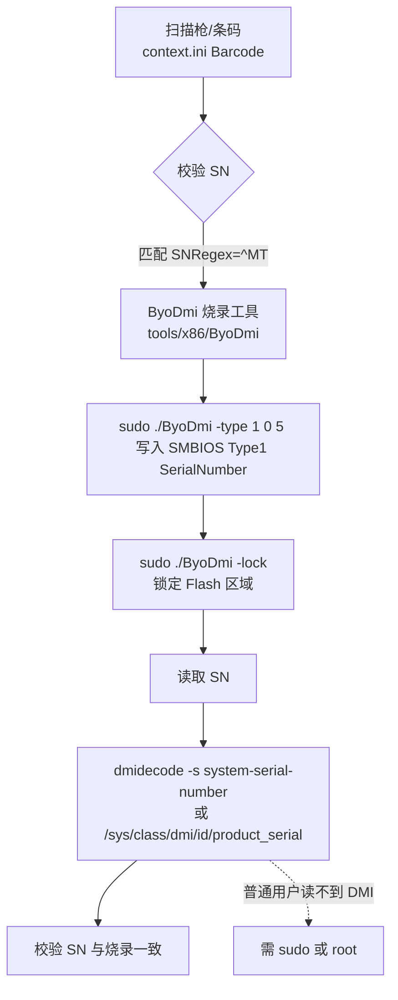

# TP100 产测系统分析：tools / 配置表 / 说明书 对应关系

> 分析对象：`G:\tp100\tp100`（YK-PC-TP100 板卡/整机产测系统，麒麟 Kylin2203，海光 x86_64）
> 目标：梳理 `tools/` 工具、`config/` 配置表、`start.sh`/`script.config` 说明书之间的对应关系，含烧录读取 SN 全链路

## 一、系统架构

```mermaid
flowchart TD
  A[start.sh<br/>提权+环境变量+启动] --> B[YK-PC-TP100 主程序]
  B --> C[config 配置表]
  C --> C1[settings.ini<br/>产线/工站/MES/SN 规则]
  C --> C2[script.config<br/>测试脚本模板(工站+用例)]
  C --> C3[context.ini<br/>运行上下文+SN 条码]
  B --> D[plugins 插件库]
  D --> D1[libCore.so 核心/用例执行]
  D --> D2[libMes.so MES 通信]
  D --> D3[libScanner.so 扫码枪]
  D --> D4[libComTest/libHardDiskTest/libUsbTest]
  B --> E[tools 测试工具]
  E --> E1[tools/common 通用工具]
  E --> E2[tools/x86 板卡工具]
  B --> F[log/ 日志]
  B --> G[MES 系统<br/>192.168.127.10]
```

## 二、测试工站流程

```mermaid
flowchart LR
  subgraph BFT[Station_BFT 板卡功能测试]
    B1[时间同步 TimeSyncTest]
    B2[整机SN写入 BoardSNWrite<br/>ByoDmi 烧录 DMI]
    B3[SN读取 BoardSNRead]
    B4[BIOS版本检查]
    B5[MCU版本检查 CallThirdTools]
    B6[设置Grub/自登录]
  end
  subgraph IBT[Station_IBT 整机烧录测试]
    I1[CPU压力 CPUPressureTest]
    I2[内存压力 StressAppTest]
    I3[LTP整机压力 AssemblyLTPTest]
    I4[S3睡眠/S4休眠/重启老化]
  end
  subgraph IFT[Station_IFT 整机功能测试]
    F1[SN读取 BoardSNRead]
    F2[硬盘/BIOS/CPU/内存检查]
    F3[风扇/温度测试]
    F4[USB/网络开关/视频/音频]
  end
  BFT --> IBT --> IFT
```



## 三、烧录 / 读取 SN 链路（核心）



**SN 存储位置**：SMBIOS/DMI **Type 1（System Information）SerialNumber 字段**——`dmidecode -s system-serial-number` / `/sys/class/dmi/id/product_serial` 即此位置。

| 环节 | 工具 | 命令/文件 | 说明 |
|---|---|---|---|
| SN 校验规则 | settings.ini | `NeedSNCode=true` `SNRegex=^MT` | SN 必须 MT 开头 |
| SN 条码 | context.ini | `Barcode=MT81...` | 实际 SN（如 MT81KFGSH-...） |
| SN 烧录 | ByoDmi | `sudo ./ByoDmi -type 1 0 5 <SN>` | 写 Type1 Serial |
| 查看 SN | ByoDmi | `sudo ./ByoDmi -smbiosinfo` / `-view 1 0` | 读 DMI |
| 读 SN | dmidecode | `dmidecode -s system-serial-number` | 标准读取 |
| 锁定 | ByoDmi | `sudo ./ByoDmi -lock` | 烧录后锁定防篡改 |

## 四、配置文件字段说明

### `config/settings.ini`

| 段 | 字段 | 说明 |
|---|---|---|
| [FACTORY] | StationNumber / LineNumber / TesterNumber | 工站/产线/测试员编号 |
| [MES] | BindMesIP / URL / Token / UserName | MES 系统接入 |
| [MES] | FTPIp / FTPUser / FTPPassword | 结果上传 FTP |
| [SYSTEM] | ProductModel=MT81C / CPU=Hygon / OperatingSystem | 机型/CPU/系统 |
| [SYSTEM] | AutoStart / CanRetryTest / MesType | 测试行为 |
| [Scanner] | NeedSNCode=true / SNRegex=^MT | SN 扫码规则 |
| [TestScript] | TestScriptPath=*.tsp | 测试脚本 |

### `config/script.config`（工站+用例模板）

| 工站 | 用例 | 用途 |
|---|---|---|
| BFT | BoardSNWrite / BoardSNRead | SN 烧录 / 读取 |
| BFT | BIOSVersionCheck / CallThirdTools | BIOS/MCU 版本 |
| BFT | SetGrubConfig / SetlightdmConfig | 系统启动配置 |
| IBT | CPUPressureTest / StressAppTest / AssemblyLTPTest | 压力测试 |
| IBT | S3AgingTest / S4AgingTest / RebootTest | 睡眠/重启老化 |
| IFT | HardDiskCheckTest / MemoryTest / CPUVersionCheck | 硬件检查 |
| IFT | FanTest / USBNumberScanTest / OnlineButtonTest | 风扇/USB/开关 |
| IFT | DHVTest / SLJAudioDeviceTest | 视频/音频 |

## 五、tools 工具清单与对应关系

### `tools/common`（通用）

| 工具 | 说明 | 关联配置/用例 |
|---|---|---|
| mc-logsfcs | 读系统信息(uuid/bios) 上传 FCS | [MES]/[FACTORY] |
| reboot | 重启测试 | IBT RebootTest |
| s3 / s4 | S3睡眠 / S4休眠老化 | IBT S3/S4AgingTest |
| DHVTester | 视频信号源测试(DHV) | IFT DHVTest |
| check_physical_switch.sh | 物理开关检测 | IFT OnlineButtonTest |

### `tools/x86`（板卡）

| 工具 | 说明 | 关联配置/用例 |
|---|---|---|
| **ByoDmi** | DMI/SMBIOS 烧录(SN/UUID) | BFT BoardSNWrite |
| FD30_DMI | 同 ByoDmi(FD30 机型版) | 按机型选 |
| ECTester | EC 测试(充电/EC状态/风扇/LED/合盖) | IFT 硬件检查 |
| AudioTest / SLJ_AudioTest | 音频测试(世兰江) | IFT SLJAudioDeviceTest |
| FanControl | 风扇控制 | IFT FanTest |
| linuxpg | 网卡驱动/加载(Realtek r8xxx) | 网络相关 |
| Motorcomm | 网卡测试 | IFT 网络 |
| LTP | Linux 压力测试套件 | IBT AssemblyLTPTest |
| stressapptest | 内存压力测试 | IBT StressAppTest |
| iperf | 网络带宽测试 | IFT 网络 |
| ntpdate | 时间同步 | BFT TimeSyncTest |

## 六、用例 ↔ 工具 ↔ 配置 总对应表

| TestCase | 中文 | 工具 | 配置 |
|---|---|---|---|
| TimeSyncTest | 时间同步 | ntpdate | [TestScript] |
| BoardSNWrite | SN 烧录 | ByoDmi | [Scanner] SNRegex |
| BoardSNRead | SN 读取 | dmidecode/ByoDmi | [Scanner] NeedSNCode |
| BIOSVersionCheck | BIOS 版本 | dmidecode | [SYSTEM] |
| CallThirdTools | MCU 版本 | 第三方工具 | — |
| CPUPressureTest | CPU 压力 | 系统工具 | — |
| StressAppTest | 内存压力 | stressapptest | — |
| AssemblyLTPTest | 整机压力 | LTP | — |
| S3/S4AgingTest | 睡眠/休眠老化 | tools/common/s3,s4 | — |
| RebootTest | 重启老化 | tools/common/reboot | — |
| HardDiskCheckTest | 硬盘检查 | libHardDiskTest | — |
| MemoryTest | 内存测试 | stressapptest | — |
| FanTest | 风扇测试 | FanControl | — |
| USBNumberScanTest | USB 扫描 | libUsbTest | — |
| OnlineButtonTest | 网络开关 | check_physical_switch | — |
| DHVTest | 视频信号源 | DHVTester | — |
| SLJAudioDeviceTest | 音频设备 | SLJ_AudioTest | — |

## 七、os-active 关联建议

- **SN 读取对齐**：TP100 的 SN 在 DMI Type1 Serial——os-active `get_sn()` 已用 `product_serial`/`dmidecode` 读取，**存储位置一致** ✓
- **权限兜底**：麒麟普通用户读不到 DMI Serial（0400 root），需 root 或 sudo 才能拿到 MT-SN；当前 fallback 到 machine-id 可标识设备但非厂商 SN
- **可扩展**：如需读取 TP100 烧录的 MT-SN，可让 os-active 尝试 `sudo dmidecode -s system-serial-number`（配 sudoers NOPASSWD）

---
> 本分析基于 `G:\tp100\tp100` 的 `config/`、`tools/`、`start.sh`、`script.config` 及工具 README 整理。
